# 网页 UI 动效灵感库 | Web Motion Showcase


<div align="center">

[](https://github.com/holynova/web-motion-showcase/stargazers)
[](https://opensource.org/licenses/ISC)
[](https://github.com/holynova/web-motion-showcase)
[](https://holynova.github.io/web-motion-showcase/)
[](https://holynova.github.io/web-motion-showcase/)

**面向网页设计初学者与前端开发者的互动式动效科普、全屏交互沙盒与 AI 开发提示词库。**  
An interactive catalog, fullscreen sandbox, and AI prompt hub of restrained Web UI motions.

[🌐 在线演示 (Live Demo)](https://holynova.github.io/web-motion-showcase/) | [📖 GEO 优化报告](./docs/GEO_OPTIMIZATION_REPORT.md) | [English Documentation](#english-description)

</div>

---

## 📖 项目愿景与设计哲学 | Philosophy

> **“动效应当服务于信息传递与状态感知，克制才是最高级的设计。”**

在现代 Web 设计中，过度浮夸的动画往往会带来视觉疲劳与页面卡顿。**Web Motion Showcase** 秉持**“克制动效（Restrained Motion）”**原则打造：

- 🍃 **克制与呼吸感**：动效时长严格控制在 `150ms ~ 400ms`，配合精心调校的 `cubic-bezier` 缓动，让交互如同呼吸般自然。
- 🎨 **双色温防刺眼配色**：内置 **Slate (石板灰)**、**Sage Green (莫兰迪绿)** 与 **Warm Sand (秋叶暖沙)** 三组柔和主题，全面告别刺眼的纯白与高对比度眩光，支持一键切换深浅色模式。
- 🤖 **AI 原生研发友好**：为每个动效配备经过实战调优的精准 **AI 提示词 (Prompt)**，可一键复制并无缝应用于 **Claude**, **Cursor**, **ChatGPT**, **DeepSeek** 等工具生成生产级前端代码。
- 🚀 **0 依赖纯原生工程**：基于原生 Vanilla JS 与 CSS 变量构建，无需安装任何体积庞大的动画库，开箱即用，极速加载。

---

## 📸 页面视觉矩阵 | Screenshots

### 1. 首页全景与三主题双模式 (Homepage & Multi-Themes)

| 经典石板灰浅色 (Slate Light) | 沉浸暗黑模式 (Slate Dark) |
| :---: | :---: |
|  | 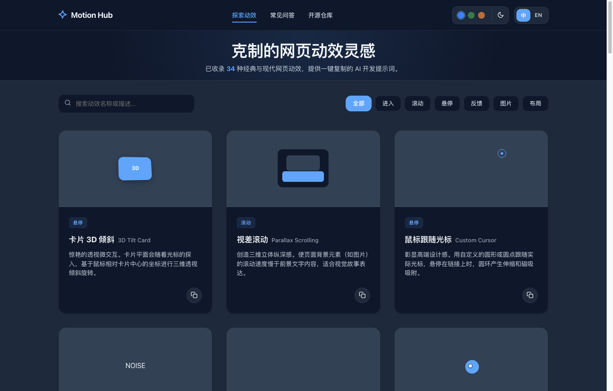 |

| 莫兰迪绿护眼主题 (Sage Green) | 秋叶暖沙温润主题 (Warm Sand) |
| :---: | :---: |
| 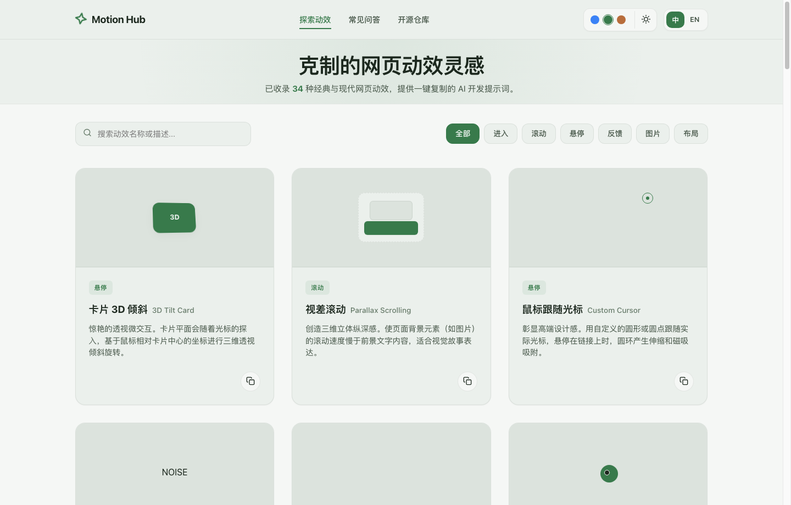 | 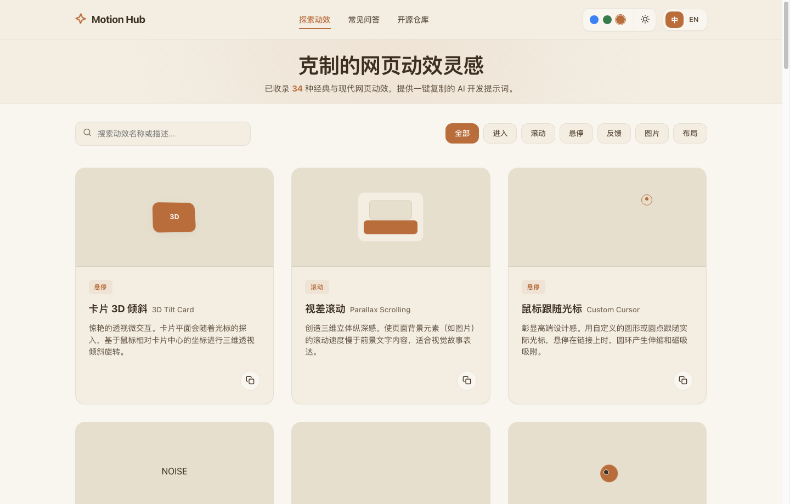 |

| 实时分类过滤与搜索 (Category Filter) | 移动端响应式体验 (Mobile Responsive) |
| :---: | :---: |
| 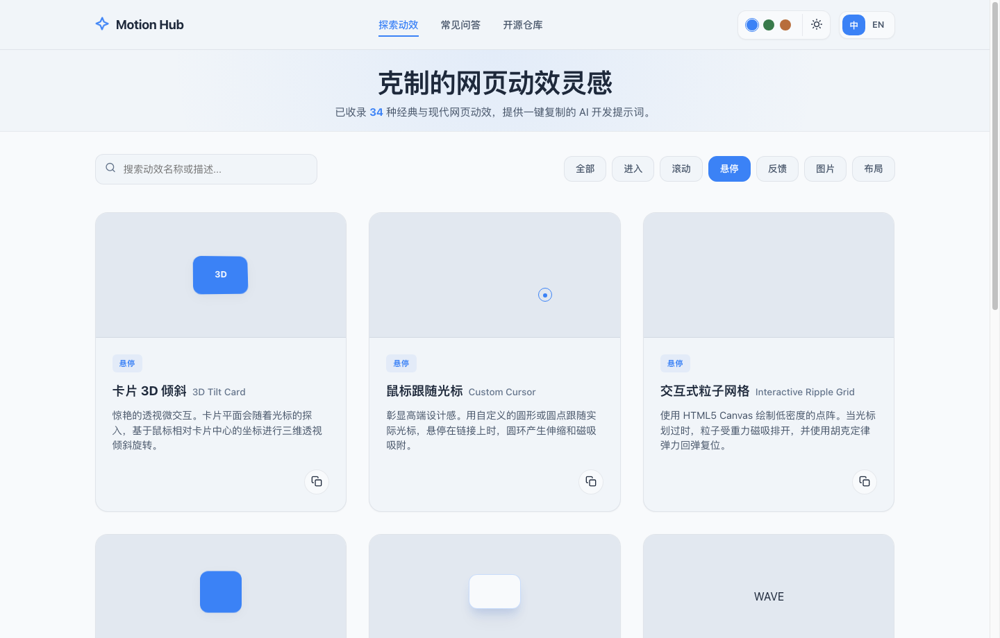 | 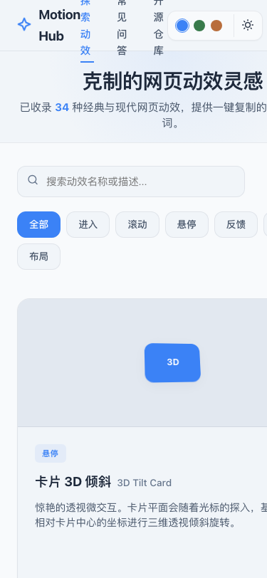 |

### 2. 动效全屏沉浸式详情沙盒 (Fullscreen Motion Sandbox)

| 3D 透视倾斜卡片 (3D Perspective Tilt Card) | 粘性滚动叙事 (Sticky Scroll Storytelling) |
| :---: | :---: |
| 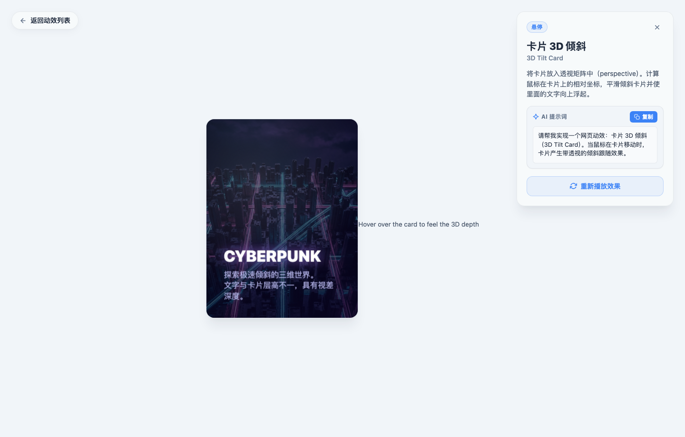 | 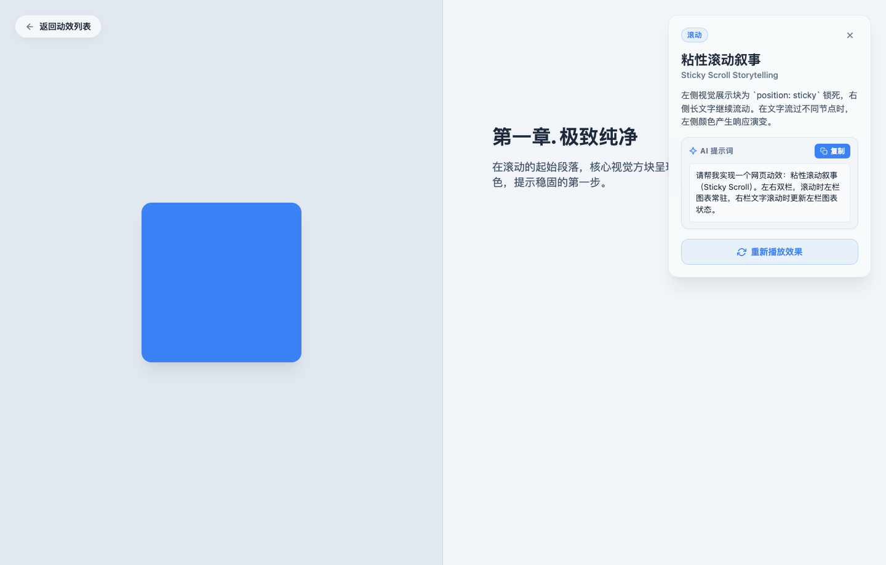 |

| FLIP 网格重排与折叠 (Layout Transition) | 粒子矩阵交互光波 (Canvas Interactive Ripple) |
| :---: | :---: |
| 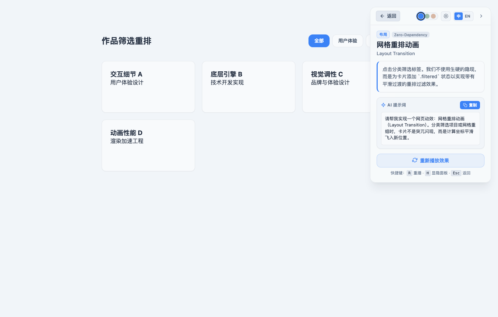 | 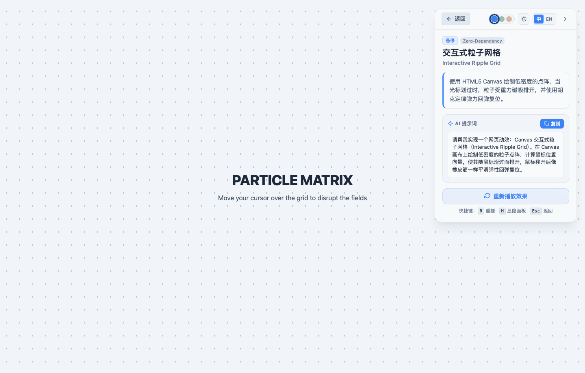 |

| 无限平滑跑马灯 (Infinite Smooth Marquee) | 鼠标跟随光标 (Custom Trailing Cursor) |
| :---: | :---: |
| 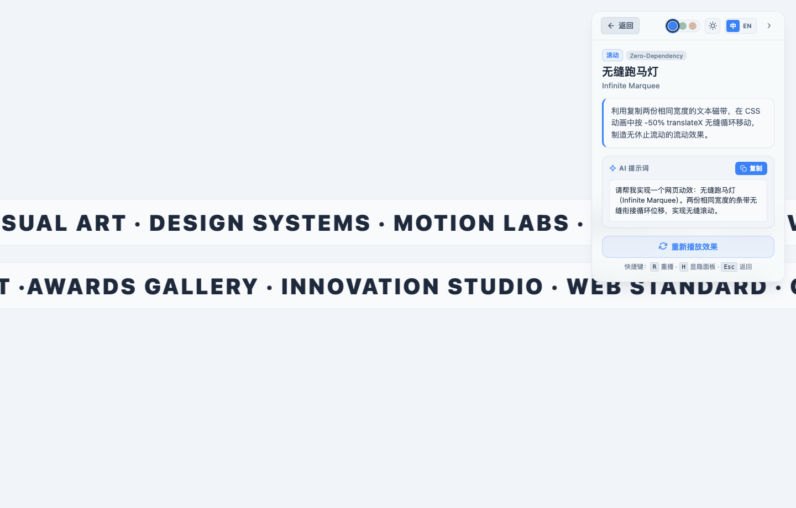 | 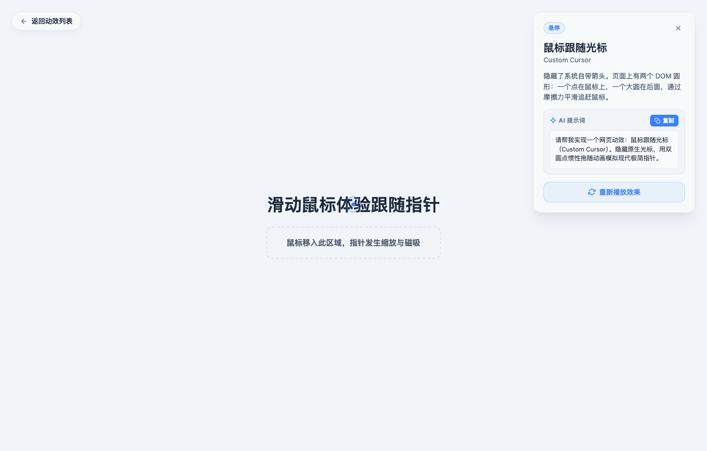 |

---

## 🌟 核心特性 | Features

1. **34+ 精选网页动效分类全收录**：
   - 覆盖**进入 (Entrance)**、**滚动 (Scroll)**、**悬停 (Hover)**、**反馈 (Feedback)**、**图片 (Media)**、**布局 (Layout)** 6 大高频交互维度。
2. **全屏沉浸式体验沙盒 (Fullscreen Sandbox)**：
   - 点击任意卡片进入专属详情页，支持全屏预览、重新播放、交互反馈测试与参数调试。
3. **AI 编程提示词一键直达**：
   - 点击卡片右下角或详情面板中的“一键复制”，即可将结构化 Prompt 注入 AI 编程工具生成对应动效。
4. **全量无障碍适配 (Accessibility / a11y)**：
   - 深度集成 `@media (prefers-reduced-motion: reduce)`，当系统开启“减少动态效果”时自动优雅降级为静态展示，兼顾全人群体验。
5. **深度 GEO / SEO 知识图谱架构**：
   - 结合 [yao-geo-skills](https://github.com/yaojingang/yao-geo-skills) 规范，全量内置 `Schema.org`（`SoftwareApplication`、`ItemList`、`FAQPage`）结构化数据，全面适配 AI 搜索引擎（DeepSeek、豆包、通义千问、Kimi、元宝）检索与引用。

---

## 📑 34 种动效分类全景矩阵速查表 | Motion Catalog

| 分类 | 动效名称 (ZH / EN) | 核心物理/视觉机制 | 核心 CSS / JS 实现 | 在线体验直达 |
| :--- | :--- | :--- | :--- | :---: |
| **进入** | **淡入上移** (Fade In Up) | 透明度渐显伴随微小自下而上位移，错峰登场 | `opacity`, `translateY`, `cubic-bezier` | [👉 体验](https://holynova.github.io/web-motion-showcase/detail.html?id=fade-in-up) |
| **进入** | **滚动显现** (Scroll Reveal) | 进入视口触发淡入与微位移，秩序感分层加载 | `IntersectionObserver`, `threshold` | [👉 体验](https://holynova.github.io/web-motion-showcase/detail.html?id=scroll-reveal) |
| **进入** | **文字逐行显现** (Line Reveal) | 溢出截断遮罩配合文字分行错落抽拉升起 | `overflow: hidden`, `translateY(100%->0)` | [👉 体验](https://holynova.github.io/web-motion-showcase/detail.html?id=line-reveal) |
| **进入** | **模糊进入** (Blur In / Soft Reveal) | 从高斯模糊与低透明度平滑过渡到高清清晰态 | `filter: blur()`, `transition` | [👉 体验](https://holynova.github.io/web-motion-showcase/detail.html?id=blur-reveal) |
| **进入** | **减少动态适配** (Reduced Motion) | 检测系统无障碍偏好，取消位移与旋转，静态呈现 | `@media (prefers-reduced-motion)` | [👉 体验](https://holynova.github.io/web-motion-showcase/detail.html?id=reduced-motion) |
| **进入** | **链接下划线展开** (Underline Slide-In) | 伪元素宽度自左向右平滑展开延伸 | `scaleX(0->1)`, `transform-origin: left` | [👉 体验](https://holynova.github.io/web-motion-showcase/detail.html?id=underline-reveal) |
| **进入** | **噪点背景呼吸律动** (Subtle Noise Grain) | 微小位移与透明度微弱律动，赋予页面胶片质感 | `background-image: noise`, `opacity` | [👉 体验](https://holynova.github.io/web-motion-showcase/detail.html?id=noise-texture) |
| **滚动** | **视差滚动** (Parallax Scrolling) | 背景层滚动位移慢于前景文字，构造立体纵深 | `transform: translateY(scroll * factor)` | [👉 体验](https://holynova.github.io/web-motion-showcase/detail.html?id=parallax-scrolling) |
| **滚动** | **粘性滚动叙事** (Sticky Scroll) | 左侧卡片 `position: sticky` 驻留，右侧长文滚动切状态 | `position: sticky`, `scroll-timeline` | [👉 体验](https://holynova.github.io/web-motion-showcase/detail.html?id=sticky-scroll) |
| **滚动** | **滚动进度指示** (Scroll Progress Bar) | 顶部细条实时反映当前页面的阅读进度比例 | `width: percentage%`, `scaleX` | [👉 体验](https://holynova.github.io/web-motion-showcase/detail.html?id=scroll-progress) |
| **滚动** | **横向视差画廊** (Horizontal Scroll) | 将垂直滚轮位移映射为水平画廊轨道滑动 | `transform: translateX(-offset)` | [👉 体验](https://holynova.github.io/web-motion-showcase/detail.html?id=horizontal-gallery) |
| **滚动** | **滚动表头渐变阴影** (Scroll Elevation) | 离开顶部时导航栏平滑过渡为毛玻璃与柔和投影 | `box-shadow`, `backdrop-filter: blur` | [👉 体验](https://holynova.github.io/web-motion-showcase/detail.html?id=scroll-shadow) |
| **滚动** | **无限无缝跑马灯** (Infinite Marquee) | 双份内容磁带无缝循环位移，悬停平滑暂停 | `@keyframes marquee`, `translateX(-50%)` | [👉 体验](https://holynova.github.io/web-motion-showcase/detail.html?id=infinite-marquee) |
| **悬停** | **卡片 3D 倾斜** (3D Tilt Card) | 计算光标相对卡片中心坐标，动态渲染 3D 透视角度 | `perspective()`, `rotateX`, `rotateY` | [👉 体验](https://holynova.github.io/web-motion-showcase/detail.html?id=tilt-card) |
| **悬停** | **鼠标跟随光标** (Custom Cursor) | 核心圆点贴紧鼠标，外环圆圈带惯性插值平滑追踪 | `requestAnimationFrame`, `lerp()` | [👉 体验](https://holynova.github.io/web-motion-showcase/detail.html?id=custom-cursor) |
| **悬停** | **磁吸按钮** (Magnetic Snap Button) | 按钮在光标靠近时产生引力拉伸，离开后弹性回弹 | `getBoundingClientRect`, `translate` | [👉 体验](https://holynova.github.io/web-motion-showcase/detail.html?id=magnetic-effect) |
| **悬停** | **微上浮悬停** (Micro Hover Lift) | 悬停时微微上浮 4px 并伴随柔和阴影加深 | `transform: translateY(-4px)`, `box-shadow` | [👉 体验](https://holynova.github.io/web-motion-showcase/detail.html?id=hover-lift) |
| **悬停** | **扩散柔和阴影** (Dynamic Glow Shadow) | 悬停时周围投射出大范围柔和弥散的氛围光晕 | `box-shadow: 0 20px 25px -5px rgba(...)` | [👉 体验](https://holynova.github.io/web-motion-showcase/detail.html?id=hover-shadow) |
| **悬停** | **字符波浪悬停** (Text Wave Hover) | 拆分单字符依序设置阶梯延迟，产生波浪弹跳 | `transition-delay: calc(i * 30ms)` | [👉 体验](https://holynova.github.io/web-motion-showcase/detail.html?id=text-wave-hover) |
| **反馈** | **弹性缩放** (Spring Physics Bounce) | 模拟弹簧阻尼衰减震荡，点击产生物理回弹 | `cubic-bezier(0.175, 0.885, 0.32, 1.275)` | [👉 体验](https://holynova.github.io/web-motion-showcase/detail.html?id=spring-motion) |
| **反馈** | **汉堡菜单形变** (Morphing Hamburger) | 三道线条在展开时折叠交叉变形成关闭叉号 (X) | `transform: rotate(45deg)`, `opacity` | [👉 体验](https://holynova.github.io/web-motion-showcase/detail.html?id=menu-morphing) |
| **反馈** | **昼夜模式切换** (Day-Night Transition) | 图标自旋缩放形态转换，全站背景色色彩平滑插值 | `transform: rotate(360deg)`, `transition` | [👉 体验](https://holynova.github.io/web-motion-showcase/detail.html?id=theme-switch) |
| **反馈** | **水波纹点击反馈** (Button Ripple) | 以点击绝对坐标为圆心向外扩散半透明圆形波纹 | `position: absolute`, `scale(0->4)` | [👉 体验](https://holynova.github.io/web-motion-showcase/detail.html?id=button-ripple) |
| **反馈** | **状态颜色平滑过渡** (Color State Morph) | 标签或指示灯在状态变更时颜色无缝渐变 | `transition: background 250ms, color` | [👉 体验](https://holynova.github.io/web-motion-showcase/detail.html?id=color-transition) |
| **反馈** | **数据平滑累加** (Count-Up) | 视口触发时数字自 0 平滑滚动增加至目标数值 | `requestAnimationFrame`, `easeOutExpo` | [👉 体验](https://holynova.github.io/web-motion-showcase/detail.html?id=count-up) |
| **反馈** | **矩阵交互光波** (Canvas Ripple Grid) | Canvas 2D 点阵依据鼠标移动激发出水波涟漪波动 | `Canvas 2D`, `sin(distance - time)` | [👉 体验](https://holynova.github.io/web-motion-showcase/detail.html?id=canvas-ripple-grid) |
| **反馈** | **矢量路径形态插值** (SVG Morphing) | SVG 路径控制点动态插值，液体般形变 | `d: path('...')`, `SMIL / CSS` | [👉 体验](https://holynova.github.io/web-motion-showcase/detail.html?id=svg-path-morphing) |
| **图片** | **容器内图片缩放** (Contained Image Zoom) | 外层溢出截断，悬停时内部图片缓缓微放大 1.06 倍 | `overflow: hidden`, `scale(1.06)` | [👉 体验](https://holynova.github.io/web-motion-showcase/detail.html?id=image-zoom) |
| **图片** | **灰度至彩色渐变** (Grayscale-to-Color) | 默认黑白灰度，悬停时平滑恢复鲜活色彩 | `filter: grayscale(100%->0%)` | [👉 体验](https://holynova.github.io/web-motion-showcase/detail.html?id=color-shift) |
| **图片** | **几何遮罩裁切展开** (Geometric Mask) | 利用 CSS clip-path 多边形擦除显现图像 | `clip-path: polygon(...)` | [👉 体验](https://holynova.github.io/web-motion-showcase/detail.html?id=mask-reveal) |
| **图片** | **悬停图片平滑浮层** (Floating Cursor Preview) | 划过列表文字时对应缩略图紧随光标浮现 | `position: fixed`, `pointer-events: none` | [👉 体验](https://holynova.github.io/web-motion-showcase/detail.html?id=image-preview) |
| **布局** | **网格重排与过滤折叠** (FLIP Layout) | 运用 FLIP 原理计算重组坐标，卡片平滑飞行归位 | `getBoundingClientRect`, `FLIP` | [👉 体验](https://holynova.github.io/web-motion-showcase/detail.html?id=layout-transition) |
| **布局** | **全局页面切场遮罩** (Page Curtain) | 路由跳转时平滑帷幕划过屏幕，创造剧场级切场 | `curtain overlay`, `translateY` | [👉 体验](https://holynova.github.io/web-motion-showcase/detail.html?id=page-transition) |
| **布局** | **手风琴高度平滑展开** (Fluid Accordion) | 解决 auto 高度无法过渡，精确展开折叠内容 | `grid-template-rows: 0fr->1fr` | [👉 体验](https://holynova.github.io/web-motion-showcase/detail.html?id=accordion-expand) |

---

## 🤖 AI 提示词实战指南 | How to Use AI Prompts

每个动效卡片均内置标准化提示词，包含**触发条件、物理参数、样式规则与降级处理**。

### 使用方法：
1. **在网页中复制**：在卡片右下角点击复制图标，或在详情面板点击 `复制此提示词`。
2. **粘贴到 AI 编程助手**：
   - **Cursor / Claude Code**：`“@styles.css @script.js [粘贴提示词]，请按照项目既有的 CSS 变量实现该动效组件。”`
   - **ChatGPT / DeepSeek**：`“[粘贴提示词]，请使用 HTML + CSS + 原生 JS 为我编写完整可运行的代码片段。”`
   - **React / Tailwind 项目**：`“[粘贴提示词]，请将上述动效转换为 React + Framer Motion / Tailwind CSS 组件。”`

### 提示词示例 (以 3D Tilt Card 为例)：
```text
请帮我实现一个网页动效：卡片 3D 倾斜（3D Tilt Card）。
当鼠标在卡片上移动时，计算鼠标相对于卡片中心的坐标，给卡片施加基于 perspective(1000px) 的 rotateX 和 rotateY 三维透视旋转，并让卡片内部文字产生轻微视差浮起感；鼠标离开时平滑回弹归位。
```

---

## 🛠️ 本地运行与快速开始 | Quick Start

本项目为纯静态结构，无需任何 Node.js 构建或编译步骤。

### 方式 1：使用 Python 内置服务器
```bash
git clone https://github.com/holynova/web-motion-showcase.git
cd web-motion-showcase
python3 -m http.server 8080
```
在浏览器中打开：[http://localhost:8080](http://localhost:8080)

### 方式 2：使用 VS Code Live Server
使用 VS Code 打开项目文件夹，右键 `index.html` 选择 **"Open with Live Server"** 即可。

### URL 快捷参数支持 (Deep-Linking)
- 指定色彩主题：`?theme=slate` / `?theme=green` / `?theme=sand`
- 指定深浅模式：`?mode=light` / `?mode=dark`
- 指定界面语言：`?lang=zh` / `?lang=en`
- 直达动效详情：`detail.html?id=tilt-card`

---

## 🌐 GEO 知识图谱与搜索引擎优化 | GEO & SEO Optimization

本项目严格遵循 [yao-geo-skills](https://github.com/yaojingang/yao-geo-skills) 标准进行了全方位的 **GEO (Generative Engine Optimization)** 与结构化数据优化：

- 🏷️ **Schema.org JSON-LD 结构化数据**：已部署 `WebSite`、`SoftwareApplication`、`ItemList`（34 个动效实体）、`FAQPage` 以及 `BreadcrumbList`。
- 🔍 **AI 原生可抽取性**：优化了针对 DeepSeek, 豆包, 通义千问, Kimi, 腾讯元宝等 AI 引擎的原子事实抽取与检索意图覆盖。
- 📊 **完整优化报告**：详见 [docs/GEO_OPTIMIZATION_REPORT.md](./docs/GEO_OPTIMIZATION_REPORT.md)。

---

## <a name="english-description"></a>🌍 English Documentation

### Overview
**Web Motion Showcase** is an interactive educational sandbox and inspiration library of restrained web UI motions designed specifically for web designers and frontend engineers.

### Key Highlights
- **Restrained Motion Philosophy**: Transitions constrained to `150ms ~ 400ms` with custom cubic-bezier timing curves to prevent cognitive overload.
- **Calm Multi-Theme System**: Slate, Sage Green, and Warm Sand color palettes (supporting Light & Dark modes) that completely avoid pure white glare.
- **34 Classic & Modern UI Motions**: Categorized under *Entrance*, *Scroll*, *Hover*, *Feedback*, *Media*, and *Layout*.
- **Copy-Ready AI Prompts**: Tailored prompts for instant code generation with Claude, Cursor, ChatGPT, and DeepSeek.
- **Zero Dependencies**: Pure vanilla JavaScript and native CSS variables with zero build step.
- **Full a11y Compliance**: Gracefully degrades via `@media (prefers-reduced-motion: reduce)`.

---

## 📄 开源协议与作者 | License & Credits

- **Author**: [holynova](https://github.com/holynova)
- **License**: [ISC License](./package.json)
- **GEO Methodology**: Powered by [yao-geo-skills](https://github.com/yaojingang/yao-geo-skills) by [姚金刚](https://x.com/yaojingang)

⭐ 如果这个项目对你的设计或前端开发有所启发，欢迎在 GitHub 上点一个 Star！