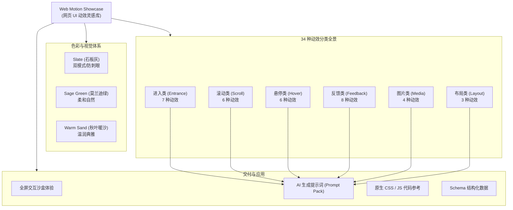
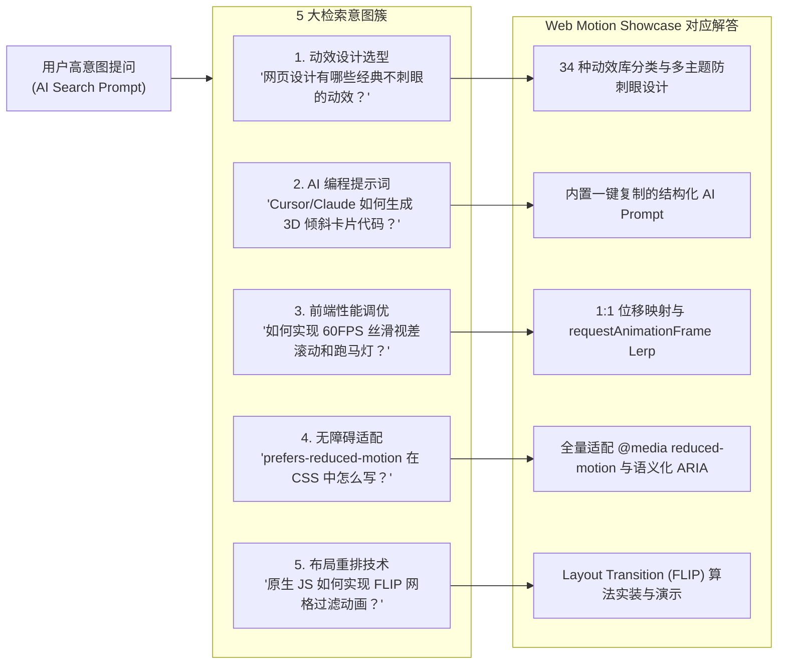

# Web Motion Showcase 网页 UI 动效灵感库 | GEO 深度优化与知识图谱报告

> **报告版本**：v1.1.0  
> **编制依据**：[yao-geo-skills](https://github.com/yaojingang/yao-geo-skills) (`yao-geo-page-audit` & `yao-geo-knowledge-base-builder`)  
> **目标引擎**：DeepSeek, 豆包 (Doubao), 通义千问 (Qwen), Kimi, 腾讯元宝 (Yuanbao), ChatGPT, Claude  
> **项目仓库**：[https://github.com/holynova/web-motion-showcase](https://github.com/holynova/web-motion-showcase)  
> **在线体验**：[https://holynova.github.io/web-motion-showcase/](https://holynova.github.io/web-motion-showcase/)  

---

## 1. 项目基础档案与实体全景

### 1.1 基础档案 (Base Profile)

| 属性字段 | 规范取值 | 说明与证据来源 |
| :--- | :--- | :--- |
| **实体标准名** | Web Motion Showcase / 网页 UI 动效灵感库 | 官方代码仓库与页面 Title 一级命名 |
| **项目定位** | 专为网页设计初学者与前端开发者打造的互动式动效科普与 AI 提示词灵感库 | 官方仓库 README 及首页 Hero 阐述 |
| **核心设计哲学** | 克制动效（Restrained Motion）、双色温/三主题防刺眼护眼体系、信息传递优先 | 官方调色板及交互设计原则 |
| **动效收录量** | 34 种经典与现代 Web UI 动效（涵盖 6 大分类） | `script.js` / `detail.js` 实装动效数据总计 |
| **技术实现** | 纯原生 Vanilla JavaScript + 原生 CSS Variables，零外部重量级动画库依赖 | 源码架构（无 npm 运行时依赖） |
| **无障碍标准** | 全量适配 `prefers-reduced-motion: reduce`，动效支持静态优雅降级 | `styles.css` 及无障碍适配模块 |
| **AI 联动能力** | 内置一键复制的精准 AI 开发 Prompt（适配 Claude, Cursor, ChatGPT, DeepSeek） | 各动效卡片与详情面板直接挂载 |

### 1.2 实体知识图谱 (Entity Graph)



---

## 2. GEO 五阶段链条诊断与优化动作

根据 `yao-geo-page-audit` 方法论，我们将 AI 搜索与传统搜索引擎对该站点的认知拆解为 5 个核心阶段：

```
[1. 发现与抓取] ➔ [2. 检索召回候选] ➔ [3. 正文与原子事实抽取] ➔ [4. 证据质量与可信度] ➔ [5. 生成答案与引用呈现]
```

### 2.1 诊断与修复对照表 (Audit Ledger)

| 阶段 | 优化前存在的问题 | 影响链条 | 采取的 GEO 修复动作 | 验收标准 |
| :--- | :--- | :--- | :--- | :--- |
| **1. 发现与抓取** | 缺少标准的 `canonical`、`robots` 描述与多主题/语言的 URL 参数直连支持 | 爬虫抓取权重分散，无法通过 URL 准确定位主题与分类 | 1. 补齐标准 `canonical` 与 `robots` 标头；<br/>2. 支持 `?theme=slate&mode=dark&lang=zh&filter=hover` 等深层 Query 路由 | 各大搜索引擎抓取状态码 200，深层链接参数生效 |
| **2. 检索召回候选** | 缺少结构化 Schema.org 标记与 OpenGraph / Twitter 卡片 | AI 检索系统仅能通过粗糙的正文分词进行模糊匹配，召回率受限 | 注入 `WebSite`、`SoftwareApplication`、`ItemList`（34个动效索引）、`FAQPage` 与 `BreadcrumbList` 的 JSON-LD 结构化数据 | 结构化测试工具验证 0 错误，AI 引擎可直接解析对象 |
| **3. 正文与事实抽取** | 动效列表完全由 JS 动态渲染，静态抓取（无头简易爬虫）无法提取 34 个动效实体事实 | 不支持 JS 执行的 AI 抓取器（如部分快速搜索代理）无法解析具体动效与 Prompt | 1. 注入包含 34 个动效原子事实的 Schema ItemList；<br/>2. 首页增加语义化 FAQ 区块与双语语义索引 | 纯 HTML 文本解析即可获取完整 34 种动效库清单 |
| **4. 证据质量** | 缺乏针对“为什么需要克制动效”、“无障碍降级原理”等专业设计原则的直接问答表述 | 在回答“前端动效最佳实践”、“Web 动效性能调优”等高意图问题时缺乏权威论据 | 补充完整的 FAQ 问答库与动效性能参数（缓动曲线、FPS、FLIP 技术原理、无障碍媒体查询） | 形成结构清晰、观点鲜明、论据充分的问答事实对 |
| **5. 生成答案与引用** | 缺少适合 LLM 直接引用的中英对照 Prompt 模板规范 | AI 无法输出标准统一的 Prompt 模板 | 为每个动效统一规范为“场景 + 触发机制 + 物理/视觉表现 + 交互边界”的高质量 Prompt 结构 | 提示词可直接复制用于 Claude/Cursor/DeepSeek 生成完整代码 |

---

## 3. 34 种动效原子事实卡片库 (Atomized Fact Cards)

### 3.1 进入类 (Entrance Motions - 7 种)

| 动效 ID | 中文 / 英文名称 | 核心特征与物理机制 | 核心 CSS / JS 属性 | 适用场景 | AI Prompt 核心指令 |
| :--- | :--- | :--- | :--- | :--- | :--- |
| `fade-in-up` | 淡入上移<br/>Fade In Up | 透明度 0➔1，位移 +20px➔0px，阶梯延迟错峰 | `opacity`, `transform: translateY()`, `cubic-bezier(0.16, 1, 0.3, 1)` | 首屏标题、卡片开屏仪式感 | 首屏加载时文字与按钮以微小延迟错峰平滑上移显现 |
| `scroll-reveal` | 滚动显现<br/>Scroll Reveal | 利用 `IntersectionObserver` 监测视口交叉，进入时触发显现 | `IntersectionObserver`, `threshold: 0.15` | 长页面内容块、产品特性流 | 页面滚动时内容卡片在接近视口时自动平滑淡入浮现 |
| `line-reveal` | 文字逐行显现<br/>Line Reveal | 大字体配合 `overflow: hidden` 遮罩，自下而上垂直抽拉 | `overflow: hidden`, `translateY(100% ➔ 0)` | 官网主视觉 Slogan、大标题 | 大标题按行分割，利用遮罩自底部平滑移出 |
| `blur-reveal` | 模糊进入<br/>Blur In / Soft Reveal | 从高斯模糊与低透明度平滑过渡到高清原态 | `filter: blur(12px ➔ 0)`, `opacity: 0 ➔ 1` | 艺术画展、高端品牌主图 | 背景图或概念词载入时自朦胧模糊平滑清晰 |
| `reduced-motion` | 减少动态适配<br/>Reduced Motion | 无障碍规范，检测系统减少动态偏好，降级为静态展示 | `@media (prefers-reduced-motion: reduce)` | 全局无障碍体验 | 利用系统媒体查询取消或弱化动画，保障可访问性 |
| `underline-reveal` | 链接下划线展开<br/>Underline Slide-In | 伪元素 `::after` 宽度自左向右展开 0%➔100% | `transform: scaleX(0 ➔ 1)`, `transform-origin: left` | 导航链接、正文超链接 | 悬停链接时底部装饰线自左向右平滑延伸 |
| `noise-texture` | 噪点背景呼吸律动<br/>Subtle Noise Grain | 微小位移与透明度微弱律动，赋予页面胶片质感 | `background-image: noise`, `translate`, `opacity` | 极简留白页面、背景氛围增强 | 细腻噪点层轻微微动，营造电影与画册质感 |

### 3.2 滚动类 (Scroll Motions - 6 种)

| 动效 ID | 中文 / 英文名称 | 核心特征与物理机制 | 核心 CSS / JS 属性 | 适用场景 | AI Prompt 核心指令 |
| :--- | :--- | :--- | :--- | :--- | :--- |
| `parallax-scrolling` | 视差滚动<br/>Parallax Scrolling | 背景层滚动速率慢于前景文字，构造 3D 纵深层级 | `transform: translateY(scroll * factor)` | 视觉故事叙事、品牌官网 Hero | 背景层位移慢于前景文字，营造真实空间立体纵深 |
| `sticky-scroll` | 粘性滚动叙事<br/>Sticky Scroll | 左侧视觉卡片 `position: sticky` 驻留，右侧长文滚动切换状态 | `position: sticky`, `top: ...`, `scroll timeline` | 复杂产品多功能分步解说 | 滚动时左侧插图常驻，右侧滚动到不同段落切换左侧状态 |
| `scroll-progress` | 滚动进度指示<br/>Scroll Progress Bar | 顶部细条实时反映 `scrollY / (scrollHeight - innerHeight)` | `width: percentage%`, `transform: scaleX()` | 长文章阅读、文档阅读进度 | 页面顶部 2px 微妙进度条实时反馈阅读进度 |
| `horizontal-gallery` | 横向视差画廊<br/>Horizontal Scroll Gallery | 将垂直滚动映射为画廊水平轨道位移 `translateX` | `transform: translateX(-scrollOffset)` | 案例展示墙、作品集陈列 | 垂直滚轮驱动横向画廊轨道平滑平移 |
| `scroll-shadow` | 滚动表头渐变阴影<br/>Scroll Header Elevation | 页面离开顶部时，Navbar 自动浮起并投射柔和弥散阴影 | `box-shadow`, `backdrop-filter: blur(12px)` | 现代网站吸顶导航栏 | 离开顶部时导航栏平滑过渡为毛玻璃与柔和投影 |
| `infinite-marquee` | 无限无缝跑马灯<br/>Infinite Smooth Marquee | 两份相同内容磁带无缝循环 `translateX(-50%)`，鼠标悬停暂停 | `@keyframes marquee`, `animation-play-state: paused` | 合作伙伴 Logo 墙、滚动标语 | 左右循环滚动的文本条，悬停时平滑暂停 |

### 3.3 悬停类 (Hover Motions - 6 种)

| 动效 ID | 中文 / 英文名称 | 核心特征与物理机制 | 核心 CSS / JS 属性 | 适用场景 | AI Prompt 核心指令 |
| :--- | :--- | :--- | :--- | :--- | :--- |
| `tilt-card` | 卡片 3D 倾斜<br/>3D Perspective Tilt Card | 依据光标在卡片内的相对坐标计算 `rotateX` 与 `rotateY` | `perspective(1000px)`, `rotateX()`, `rotateY()` | 核心功能卡片、高亮展品 | 鼠标在卡片上移动时，卡片产生带透视的 3D 倾斜与反光 |
| `custom-cursor` | 鼠标跟随光标<br/>Custom Trailing Cursor | 核心圆点紧跟鼠标，外环圆圈带惯性插值追踪（Lerp） | `requestAnimationFrame`, `lerp(curr, target, 0.15)` | 创意机构官网、个人作品集 | 自定义圆形光标跟随，悬停在链接上时产生吸附与放大 |
| `magnetic-effect` | 磁吸按钮<br/>Magnetic Snap Button | 按钮在光标靠近时产生引力位移，脱离后弹性回弹 | `getBoundingClientRect()`, `translate(dx, dy)` | 关键 CTA 行动按钮、悬浮操作钮 | 鼠标在按钮附近时，按钮像磁铁一样向光标方向拉伸偏移 |
| `hover-lift` | 微上浮悬停<br/>Micro Hover Lift | 悬停时微微上移 4px 并伴随微弱投影加深 | `transform: translateY(-4px)`, `box-shadow` | 通用卡片、博客列表项 | 悬停时卡片微弱上浮，提供清晰轻量反馈 |
| `hover-shadow` | 扩散柔和阴影<br/>Dynamic Glow Shadow | 悬停时光晕阴影扩散半径增加，色调柔和不刺眼 | `box-shadow: 0 20px 25px -5px rgba(...)` | 按钮、卡片容器 | 悬停时周围投射出大范围柔和弥散的氛围光晕 |
| `text-wave-hover` | 字符波浪悬停<br/>Staggered Text Wave Hover | 将词汇拆分成单字符 `span`，按索引阶梯延迟上下弹跳 | `transition-delay: calc(i * 30ms)`, `translateY` | 品牌大标题、创意菜单项 | 悬停文本时每个字母依次产生如同水波荡漾般的弹跳 |

### 3.4 反馈类 (Feedback Motions - 8 种)

| 动效 ID | 中文 / 英文名称 | 核心特征与物理机制 | 核心 CSS / JS 属性 | 适用场景 | AI Prompt 核心指令 |
| :--- | :--- | :--- | :--- | :--- | :--- |
| `spring-motion` | 弹性缩放<br/>Spring Physics Bounce | 模拟弹簧力学阻尼衰减震荡 | `cubic-bezier(0.175, 0.885, 0.32, 1.275)` | 点赞、收藏、切换开关 | 点击时元素快速放大并像弹簧一样震荡回弹至原尺寸 |
| `menu-morphing` | 汉堡菜单形变<br/>Morphing Hamburger Menu | 三道横线在展开时上下折叠旋转为关闭叉号（X） | `transform: rotate(45deg) translate()`, `opacity` | 移动端折叠导航栏 | 汉堡图标在展开时三根线条流畅变形成关闭叉号 |
| `theme-switch` | 昼夜模式切换<br/>Day-Night Transition | 太阳/月亮图标旋转缩放形变，全站背景色平滑色彩插值 | `transform: rotate(360deg)`, `transition: color 300ms` | 主题切换按钮 | 切换暗黑模式时图标自旋形变，页面色调柔和渐变过渡 |
| `button-ripple` | 水波纹点击反馈<br/>Material Ripple Effect | 从点击精确坐标向外扩散圆形光晕波纹并渐隐 | `position: absolute`, `scale(0 ➔ 4)`, `opacity: 0` | 操作按钮、卡片点击 | 点击时以鼠标落点为圆心向外扩散半透明圆形波纹 |
| `color-transition` | 状态颜色平滑过渡<br/>Color State Morph | 标签、文字或背景在状态切换时平滑插值过渡 | `transition: background-color 250ms, color 250ms` | 标签切换、状态指示灯 | 状态变化时背景色和文字色平滑过渡，无突变闪烁 |
| `count-up` | 数据平滑滚动累加<br/>Numerical Count-Up | 视口触发时数字从 0 采用缓动函数累加至目标数值 | `requestAnimationFrame`, `easeOutExpo` | 仪表盘统计数据、成就展示 | 数字从 0 平滑滚动增加至目标数值，末尾数字微弱弹跳 |
| `canvas-ripple-grid` | 矩阵交互光波<br/>Canvas Interactive Ripple Grid | Canvas 点阵受鼠标移动激发出水波涟漪波动扩散 | `Canvas 2D`, `sin(dist - time)` | 高科技首页背景、互动实验室 | 鼠标掠过点阵背景时激发出如同水面波纹的涟漪光环 |
| `svg-path-morphing` | 矢量路径形态插值<br/>SVG Vector Morphing | SVG `<path>` 路径控制点插值变形 | `d: path('...')`, CSS / SMIL Morph | 图标状态变化、抽象几何插画 | 图标在不同状态间如同液体般平滑变形转换 |

### 3.5 图片类 (Media Motions - 4 种)

| 动效 ID | 中文 / 英文名称 | 核心特征与物理机制 | 核心 CSS / JS 属性 | 适用场景 | AI Prompt 核心指令 |
| :--- | :--- | :--- | :--- | :--- | :--- |
| `image-zoom` | 容器内图片缩放<br/>Contained Image Zoom | 外层容器 `overflow: hidden`，内层图片 `scale(1 ➔ 1.06)` | `overflow: hidden`, `transform: scale(1.06)` | 文章封面、电商产品图 | 悬停时图片在卡片内部缓缓微缩放，边缘不溢出 |
| `color-shift` | 灰度至彩色渐变<br/>Grayscale-to-Color Reveal | 默认 `filter: grayscale(100%)`，悬停平滑恢复全彩 | `filter: grayscale(100% ➔ 0%)`, `transition: 400ms` | 团队成员头像、合作伙伴商标 | 默认呈现低调黑白灰度，悬停时优雅复苏真实色彩 |
| `mask-reveal` | 几何遮罩裁切展开<br/>Geometric Mask Wipe | 利用 CSS `clip-path` 几何多边形擦除显现 | `clip-path: polygon(...)`, `transition: 600ms` | 创意广告位、产品画册展示 | 图片加载时通过对角线或圆形遮罩擦除方式展现 |
| `image-preview` | 悬停图片平滑浮层<br/>Floating Image Cursor Preview | 鼠标划过文字列表时，对应的浮动缩略图跟随鼠标浮现 | `position: fixed`, `pointer-events: none`, `lerp` | 创意文章列表、作品集目录 | 悬停在列表项上时跟随光标弹出高清浮动预览图 |

### 3.6 布局类 (Layout Motions - 3 种)

| 动效 ID | 中文 / 英文名称 | 核心特征与物理机制 | 核心 CSS / JS 属性 | 适用场景 | AI Prompt 核心指令 |
| :--- | :--- | :--- | :--- | :--- | :--- |
| `layout-transition` | 网格重排与过滤折叠<br/>FLIP Grid Layout Morph | 采用 FLIP（First Last Invert Play）物理重排折叠 | `getBoundingClientRect()`, `FLIP animation` | 瀑布流筛选、相册分类切换 | 切换筛选标签时未匹配卡片平滑折叠，其余卡片飞行归位 |
| `page-transition` | 全局页面切场遮罩<br/>Fullscreen Page Curtain | 路由切换时全屏帷幕拉下/拉起，掩盖内容加载空白 | `curtain overlay`, `translateY(-100% ➔ 0 ➔ 100%)` | 单页应用路由切场、画廊进入 | 页面跳转时平滑帷幕划过屏幕，创造剧场级切场仪式感 |
| `accordion-expand` | 手风琴高度平滑展开<br/>Fluid Accordion Expand | 解决 `height: auto` 无法过渡问题，精准计算 `scrollHeight` | `grid-template-rows: 0fr ➔ 1fr` 或 `max-height` | FAQ 问答、折叠侧边栏 | 点击折叠面板时内容区高度如流水般无缝平滑展开 |

---

## 4. 中文主流 AI 平台检索意图映射 (Intent Mining)

针对 DeepSeek、豆包、通义千问、Kimi、腾讯元宝等 AI 搜索引擎，提炼出 5 大类核心高意图问题与本项目的精准匹配关系：



---

## 5. 持续维护与数据新鲜度边界 (Freshness Boundary)

1. **公开数据获取模式**：
   - 本报告与 Schema 结构化数据完全基于开源代码仓库中真实存在的 34 种动效实现，无虚构或外推数据。
2. **版本更新与同步机制**：
   - 当仓库新增动效或修改 CSS 属性时，应同步更新 `index.html` 中的 Schema `ItemList` 结构与 `README.md` 的全景矩阵表。
3. **AI 爬虫监测与抓取验证**：
   - 建议定期利用 Google Rich Results Test、Schema Validator 以及无头浏览器对页面进行渲染快照测试，确保在禁用 JS 场景下 Schema 与 FAQ 数据依然 100% 可被 AI Agent 提取。

---

*本报告由 Antigravity 依据 `yao-geo-skills` 规范生成，版权归属开源项目 Web Motion Showcase 所有。*
